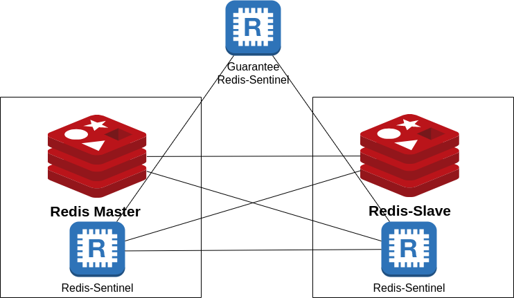

# REDIS-HA With Sentinels #



use a Strong Password 
Port Can be Changed
set IPs in .env file

## Separating Read and Write Redis Connection in .net core application ##

In this section, We want to describe how to separate the Redis connection in the .net core application.

When you are using Redis Search you may have a heavy load on your Redis server, in 'sentinel' you only connect with the 'Master' Redis server.

On the other hand, you can't write on 'Replica's, because replicas are read-only. 
In this scenario to balance your Redis server load you have to have a load balancer to read from Redis replicas.

Consider we have the following structure for our Redis servers:


### Creating a Redis connection factory ###

We have created a connection factory as follows:
```
public class RedisConnectionFactory
{
	private readonly ConnectionMultiplexer _readConnection;
	private readonly ConnectionMultiplexer _writeConnection;

	public RedisConnectionFactory(ConnectionMultiplexer readConnection, ConnectionMultiplexer writeConnection)
	{
		_readConnection = readConnection;
		_writeConnection = writeConnection;
	}
	public ConnectionMultiplexer GetReadConnection()
	{
		return _readConnection;
	}
	public ConnectionMultiplexer GetWriteConnection()
	{
		return _writeConnection;
	}
}
```
You find the above code in in the following URL:

https://github.com/maleki-it/Redis_Ha/blob/add-dotnet-api-example/RediSearch_webapi/Factories/RedisConnectionFactory.cs

### Creating a Read Connection ###

```
		var replicaConfig = new ConfigurationOptions()
		{
			Password = redisConnectionConfig.Password,
		};
		foreach (var endPoint in redisConnectionConfig.ReplicaAddresses)
		{
			replicaConfig.EndPoints.Add(endPoint);
		}
		ConnectionMultiplexer readConnectionMux = ConnectionMultiplexer.Connect(replicaConfig);
```
You can also create your read Connection in the following way:👇👇

``` ConnectionMultiplexer readConnectionMux = ConnectionMultiplexer.Connect("replica1,replica2,replica3,...,replica2n;Password=YourStrongPassword") ```

### Creating a Write Connection ###

In this scenario, you have to create a "Sentinel" Connection:
```
		var sentinelConfig = new ConfigurationOptions()
		{

			Password = redisConnectionConfig.Password,

		};
		foreach (var endPoint in redisConnectionConfig.SentinelAddresses)
		{
			sentinelConfig.EndPoints.Add(endPoint);
		}
		var sentinelConnection = ConnectionMultiplexer.SentinelConnect(sentinelConfig);
		var masterConfig = new ConfigurationOptions()
		{
			ServiceName = "mymaster",
			Password = redisConnectionConfig.Password,
			AllowAdmin = true
		};
		var masterConnection = sentinelConnection.GetSentinelMasterConnection(masterConfig);
```
You can find the full configuration in this URL: 👇👇

https://github.com/maleki-it/Redis_Ha/blob/add-dotnet-api-example/RediSearch_webapi/RedisConnectionRegistrationExtenstion.cs

